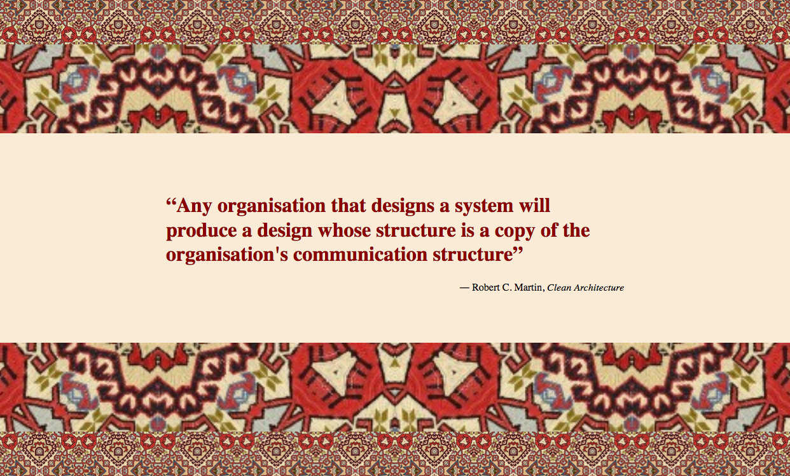

# Background Patterns

Let's create a simple page displaying a quote!
Two patterns surround the quote. The quotes are positioned in a certain way that the ones on the top are mirroring the one at the bottom.

Take a look at the examples:

Take a look into the [blockquote](https://developer.mozilla.org/en-US/docs/Web/HTML/Element/blockquote) element and make use of it.